# Audio Client Connection and Registration Flow

## Sequence Diagram

```mermaid
sequenceDiagram
    participant AC as Audio Client<br/>(SparcPyClientPi)
    participant WS as WebSocket Server<br/>(before_lecture.py)
    participant CM as Connection Manager<br/>(connection_manager.py)
    participant SD as Shared Data<br/>(shared_data.py)
    participant DB as Database<br/>(MongoDB)

    Note over AC,DB: Audio Client Connection Flow

    %% Initial Connection
    AC->>WS: WebSocket.connect("/ws/{robot_id}/before/lecture")
    WS->>CM: mgr.connect(robot_id, ws)
    CM->>CM: await ws.accept()
    CM->>CM: self._active[robot_id].add(ws)
    WS->>AC: WebSocket connection established

    %% Registration Message
    AC->>WS: Send registration message
    Note right of AC: {"type": "register",<br/>"data": {"client": "audio"},<br/>"ts": timestamp}
    
    WS->>WS: Parse registration message
    WS->>CM: mgr.tag(ws, "audio")
    CM->>CM: self._roles[ws] = "audio"
    Note right of CM: Log: "🎯 WebSocket tagged with role: audio"
    
    WS->>SD: set_connected_audio_clients(robot_id, ws)
    SD->>SD: Store audio client in global list
    Note right of SD: connected_audio_clients.append({robot_id: ws})
    
    WS->>WS: Log registration success
    Note right of WS: Log: "[robot_id] 🎵 Audio client registered and stored in shared data"
    Note right of WS: Log: "[robot_id] ➕ audio client registered"

    %% Audio Source Check (when speech is processed)
    Note over AC,DB: Later: When speech is processed...
    
    WS->>SD: get_audio_source(robot_id)
    SD->>WS: Return audio source (empty list if not set)
    Note right of WS: Log: "[robot_id] Audio source detected: []"
    
    WS->>WS: Process speech pipeline (STT → LLM → TTS)
    
    %% Audio Sending to Audio Clients
    WS->>CM: mgr.send_role(robot_id, "audio", out_msg)
    CM->>CM: sockets_by_role(robot_id, "audio")
    CM->>CM: Find WebSockets tagged with "audio" role
    Note right of CM: Log: "[robot_id] 🔍 Looking for audio clients. Total sockets: X"
    Note right of CM: Log: "[robot_id] 🎵 Found X audio client(s) to send to"
    
    CM->>AC: ws.send_json(audio_chunk_message)
    Note right of CM: Log: "[robot_id] ✅ Successfully sent audio message to socket"
    
    AC->>AC: Process audio chunks
    Note right of AC: 1. Receive audio_chunk<br/>2. Store in buffer<br/>3. Reconstruct when complete<br/>4. Play audio via PyAudio

    %% Error Handling
    alt WebSocket Error
        CM->>CM: self.disconnect(robot_id, ws)
        CM->>CM: Remove from active connections
        Note right of CM: Log: "[robot_id] ❌ Failed to send audio message to socket: error"
    end

    %% Disconnection
    AC->>WS: WebSocket disconnect
    WS->>CM: mgr.disconnect(robot_id, ws)
    CM->>CM: Remove from active connections and roles
    Note right of WS: Log: "[robot_id] client disconnected"
```

## Detailed Flow Description

### 1. **Initial Connection Phase**
- Audio client establishes WebSocket connection to `/ws/{robot_id}/before/lecture`
- Connection Manager accepts the connection and adds it to active connections
- WebSocket connection is established successfully

### 2. **Registration Phase**
- Audio client sends registration message with `client: "audio"`
- Server parses the message and tags the WebSocket with "audio" role
- Audio client is stored in shared data for global access
- Registration is logged and confirmed

### 3. **Audio Source Detection**
- When speech is processed, server checks audio source for the robot_id
- If no audio source is set (returns empty list), default behavior is triggered
- Server logs the detected audio source for debugging

### 4. **Audio Sending Phase**
- Server processes speech through STT → LLM → TTS pipeline
- Audio is chunked into smaller pieces for streaming
- Connection Manager finds all WebSockets tagged with "audio" role
- Each audio chunk is sent to all registered audio clients
- Success/failure is logged for each send operation

### 5. **Audio Client Processing**
- Audio client receives audio chunks
- Chunks are stored in buffer until complete
- Full audio is reconstructed and played via PyAudio
- Fallback audio is played if chunk reception fails

### 6. **Error Handling**
- WebSocket errors are caught and logged
- Failed connections are removed from active connections
- Audio functionality continues for other clients

### 7. **Disconnection Phase**
- When audio client disconnects, it's removed from active connections
- Role information is cleaned up
- Disconnection is logged

## Key Components

### **Audio Client (SparcPyClientPi)**
- Connects to WebSocket endpoint
- Sends registration message
- Receives and processes audio chunks
- Plays audio via PyAudio backend

### **WebSocket Server (before_lecture.py)**
- Handles WebSocket connections
- Processes registration messages
- Manages speech pipeline
- Sends audio to appropriate clients

### **Connection Manager (connection_manager.py)**
- Manages active WebSocket connections
- Tags connections with roles
- Routes messages to appropriate clients
- Handles connection lifecycle

### **Shared Data (shared_data.py)**
- Stores global state for audio clients
- Manages audio source information
- Provides access to connected clients

### **Database (MongoDB)**
- Stores conversation history
- Manages classroom/device mappings
- Persists system state

## Error Scenarios

1. **No Audio Source Set**: Default behavior sends audio to audio clients
2. **WebSocket Errors**: Failed sends are logged and connections cleaned up
3. **Chunk Reception Timeout**: Fallback audio is played
4. **Device Not Found**: External device API errors don't affect audio functionality

This flow ensures robust audio delivery while providing comprehensive logging and error handling. 