# Before Lecture Audio Client Flow (before_lecture.py)

## Complete Sequence Diagram

```mermaid
sequenceDiagram
    participant AC as Audio Client<br/>(SparcPyClientPi)
    participant BL as Before Lecture<br/>(before_lecture.py)
    participant CM as Connection Manager<br/>(connection_manager.py)
    participant SD as Shared Data<br/>(shared_data.py)
    participant SC as Speech Client<br/>(Microphone)
    participant AP as Audio Pipeline<br/>(STT→LLM→TTS)
    participant TV as TV Interface<br/>(send_image_to_devices)

    Note over AC,TV: 1. AUDIO CLIENT REGISTRATION FLOW

    %% Audio Client Connection
    AC->>BL: WebSocket.connect("/ws/{robot_id}/before/lecture")
    BL->>CM: mgr.connect(robot_id, ws)
    CM->>CM: await ws.accept()
    CM->>CM: self._active[robot_id].add(ws)
    BL->>AC: WebSocket connection established

    %% Audio Client Registration
    AC->>BL: Send: {"type":"register","data":{"client":"audio"}}
    BL->>CM: mgr.tag(ws, "audio")
    CM->>CM: self._roles[ws] = "audio"
    BL->>SD: set_connected_audio_clients(robot_id, ws)
    SD->>SD: Store audio client for robot_id
    BL->>BL: Log: "[robot_id] 🎵 Audio client registered and stored in shared data"
    BL->>BL: Log: "[robot_id] ➕ audio client registered"
    BL->>AC: Registration acknowledged

    Note over AC,TV: 2. SPEECH CLIENT REGISTRATION FLOW

    %% Speech Client Connection (separate connection)
    SC->>BL: WebSocket.connect("/ws/{robot_id}/before/lecture")
    BL->>CM: mgr.connect(robot_id, ws)
    CM->>CM: await ws.accept()
    CM->>CM: self._active[robot_id].add(ws)
    BL->>SC: WebSocket connection established

    %% Speech Client Registration
    SC->>BL: Send: {"type":"register","data":{"client":"speech"}}
    BL->>CM: mgr.tag(ws, "speech")
    CM->>CM: self._roles[ws] = "speech"
    BL->>SD: set_audio_source(robot_id, "speech")
    SD->>SD: Store audio source = "speech" for robot_id
    BL->>BL: Log: "[robot_id] ➕ speech client registered"
    BL->>SC: Registration acknowledged

    Note over AC,TV: 3. SPEECH PROCESSING AND AUDIO RESPONSE FLOW

    %% Speech Processing
    SC->>BL: Send: {"type":"speech","data":{"audio":"base64_wav_data"}}
    BL->>SD: get_audio_source(robot_id)
    SD->>BL: Return: "speech"
    BL->>BL: Log: "[robot_id] Audio source detected: speech"
    BL->>AP: pipeline(robot_id, msg, "speech")
    AP->>AP: STT → LLM → TTS processing
    AP->>BL: Return: result with wav_bytes, assistant_text, etc.

    %% Database Save
    BL->>BL: save_conv_into_db(user_text, assistant_text, db)
    BL->>BL: Log: "[robot_id]'s conversation is saved in the database successfully!"

    %% Send to Speech Client
    BL->>CM: mgr.send_role(robot_id, "speech", result["in_msg"])
    CM->>CM: Find sockets with role "speech"
    CM->>SC: Send transcribed text

    %% Image Retrieval
    BL->>BL: retrieve_image_safe(user_text, assistant_text, robot_id)
    BL->>BL: Return: closest_image_path

    %% Send Image to External Devices (can fail with 404)
    BL->>TV: send_image_to_devices(robot_id, db, image_path, log)
    TV->>TV: Try to send to external devices
    TV-->>BL: May fail with 404 "Device not found"

    %% Send Image to Frontend
    BL->>CM: mgr.send_role(robot_id, "frontend", out_msg with image_path)
    CM->>CM: Find sockets with role "frontend"

    %% Audio Chunking and Sending to Audio Clients
    BL->>BL: chunk_audio(result["wav_bytes"], CHUNK_SIZE)
    BL->>BL: Log: "[robot_id] 🔊 Sending {len} audio chunks to audio clients"

    loop For each audio chunk
        BL->>CM: mgr.send_role(robot_id, "audio", out_msg with audio_chunk)
        CM->>CM: Find sockets with role "audio"
        CM->>CM: Log: "[robot_id] 🎵 Found {count} audio client(s) to send to"
        CM->>AC: Send: {"type":"model","text":"...","audio_chunk":{...}}
        CM->>CM: Log: "[robot_id] ✅ Successfully sent audio message to socket"
    end

    BL->>BL: Log: "[robot_id] ✅ Audio chunks sent to audio clients successfully"

    Note over AC,TV: 4. AUDIO CLIENT PROCESSING

    %% Audio Client Receives and Processes
    AC->>AC: Receive audio_chunk message
    AC->>AC: Extract audio data from chunk
    AC->>AC: _decode_and_play(audio_data)
    AC->>AC: Play audio through speakers
```



## Key Points in the Flow

### 1. **Registration Phase**
- **Audio Client**: Connects and registers with `client: "audio"`
  - Gets tagged with role "audio" in Connection Manager
  - Gets stored in Shared Data via `set_connected_audio_clients()`
- **Speech Client**: Connects and registers with `client: "speech"`
  - Gets tagged with role "speech" in Connection Manager
  - Sets audio source to "speech" via `set_audio_source()`

### 2. **Speech Processing Phase**
- Speech client sends audio data
- Server processes through STT → LLM → TTS pipeline
- Audio source is detected as "speech"
- **This triggers the "speech" branch** in the code

### 3. **Audio Response Phase**
- Audio is chunked into smaller pieces
- Each chunk is sent to **all sockets tagged with role "audio"**
- Connection Manager finds audio clients and sends messages
- Audio client receives chunks and plays them

### 4. **Critical Code Path**
```python
elif audio_source == "speech":
    # Send to speech clients
    await mgr.send_role(robot_id, "speech", result["in_msg"])
    
    # Process images and send to external devices
    # ... (can fail with 404)
    
    # Send audio chunks to audio clients
    audio_chunks = chunk_audio(result["wav_bytes"], CHUNK_SIZE)
    for chunk in audio_chunks:
        out_msg = {
            "robot_id": robot_id,
            "type": "model",
            "text": result["assistant_text"],
            "audio_chunk": chunk,
            "ts": time.time(),
        }
        await mgr.send_role(robot_id, "audio", out_msg)
```

## Debugging Points

1. **Registration**: Check if audio client is properly tagged with role "audio"
2. **Audio Source**: Verify `get_audio_source(robot_id)` returns "speech"
3. **Connection Manager**: Ensure `mgr.send_role(robot_id, "audio", ...)` finds the audio client
4. **Message Format**: Confirm audio client expects `audio_chunk` format
5. **External Device Error**: The 404 error is separate and doesn't affect audio flow

The audio should flow correctly if all these steps work properly! 